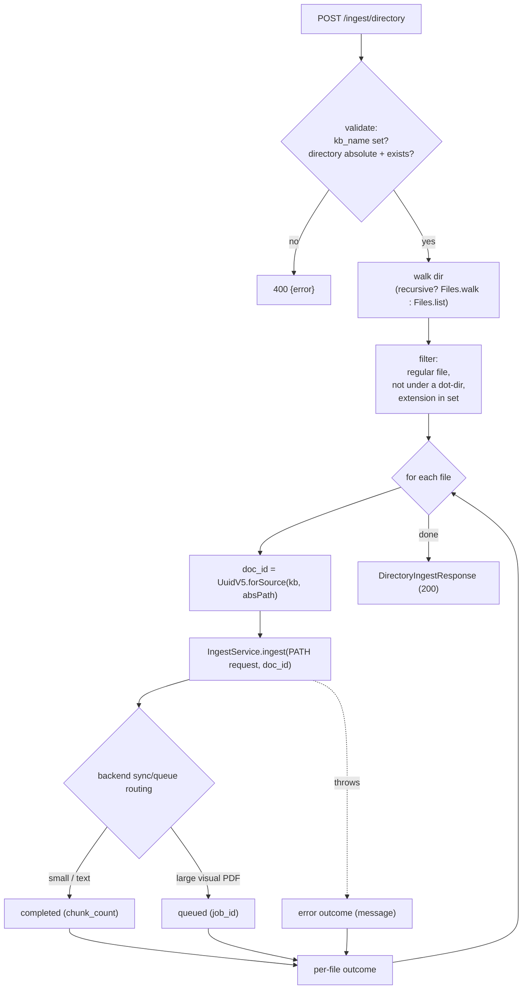

# Directory ingest (REST)

A plain HTTP endpoint that points the server at a directory on disk and
ingests every matching file — for bulk-loading an inbox or wiring a cron job,
without an MCP client. New surface, served on the **same port as `/mcp`**.

- **Logic:** `core/src/main/java/org/hayden/ingest/DirectoryIngestService.java`
  + the `DirectoryIngestRequest` / `DirectoryIngestResponse` /
  `DirectoryFileOutcome` records (all in `core/.../ingest/`).
- **Transport:** `server-http/src/main/java/org/hayden/rest/` —
  `IngestResource` (JAX-RS), `JobStatusView`, `IngestExceptionMapper`.

The split follows the repo convention: scanning + dispatch is backend-agnostic
logic in `core`; the JAX-RS binding is HTTP-specific and lives in `server-http`
(stdio has no REST). `server-http` gains a `quarkus-rest-jackson` dependency;
core beans are injected into the resource via the existing Jandex index.

## Endpoints

```
POST   /ingest/directory       scan a directory, ingest matching files
GET    /ingest/status/{jobId}  poll a queued file's job
GET    /ingest/jobs            list jobs, newest first (?status=queued|in_progress|completed|failed)
DELETE /ingest/document        remove a document (by doc_id or source_path)

GET    /kb                     list KBs: stats, per-KB document_count, total_documents roll-up
GET    /kb/{name}              one KB's status (404 if absent; ?backend= to scope)
```

`GET /ingest/jobs` returns `{total, pending, returned, jobs:[...]}` — total and
pending describe the whole queue regardless of filter. Each job row carries
`kind` (`visual`/`full`), `kb_name`, `filename`, and `submitted_at` alongside
the fields the single-job status endpoint returns. Document counts on `/kb`
are distinct `doc_id` counts via Qdrant's facet API on the payload-indexed
`doc_id` field (accurate to 10k docs per KB, then saturates; null for
backends that can't report one).

No auth (consistent with `/mcp`); relies on network isolation. JSON is
snake_case to match the MCP tool surface.

### `POST /ingest/directory`

Request:

```json
{
  "directory": "/docs/manuals",          // absolute path, required
  "kb_name": "engineering-docs",          // required
  "kb_description": "…",                   // optional (only used on KB create)
  "recursive": true,                       // optional, default true
  "extensions": ["pdf", "docx"],           // optional; omit → default doc set
  "backend": "qdrant",                     // optional → configured default
  "enable_visual_index": true,             // optional → env default
  "metadata": { "team": "platform" }        // optional, applied to every file
}
```

Response (`200`, even when some files fail):

```json
{
  "directory": "/docs/manuals",
  "kb_name": "engineering-docs",
  "files_found": 12,
  "completed": 9,
  "queued": 2,
  "failed": 1,
  "files": [
    {"path": "/docs/manuals/a.pdf", "filename": "a.pdf",
     "doc_id": "e9b81ae3-…", "status": "completed",
     "job_id": null, "chunk_count": 47, "page_count": 0,
     "message": "Ingested 47 chunks …"},
    {"path": "/docs/manuals/big.pdf", "filename": "big.pdf",
     "doc_id": "c5430c6c-…", "status": "queued",
     "job_id": "…", "chunk_count": null, "page_count": null,
     "message": "Queued for ingestion …"},
    {"path": "/docs/manuals/broken.pdf", "filename": "broken.pdf",
     "doc_id": "ce88d5c3-…", "status": "error",
     "job_id": null, "message": "PDFBox extracted no text …"}
  ]
}
```

`completed + queued + failed == files_found`. Bad input (missing `kb_name`,
non-absolute or non-existent `directory`) → `400 {"error": "…"}` via
`IngestExceptionMapper`. A failure on one *file* never aborts the scan — it
becomes an `"error"` outcome.

**The path is resolved inside the server's filesystem.** `directory` is
validated with a plain `Files.isDirectory()` in the server process — in the
Docker deployment that means *inside the container*, where only two host
locations are visible (both read-only bind mounts in `docker-compose.yml`):

| Container path | Host path | Purpose |
|---|---|---|
| `/docs` | `${INGEST_INBOX:-./incoming}` | curated inbox (also `source_type=path` MCP ingest) |
| `/host` | `${INGEST_HOST_ROOT:-$HOME}` | broad host access for this endpoint |

So to ingest an arbitrary host directory, prefix it: host
`$HOME/projects/manuals` → payload `"directory": "/host/projects/manuals"`.
Set `INGEST_HOST_ROOT=/` in `.env` to expose the entire host filesystem
(`/host/etc`, `/host/home/…`; Linux only — macOS Docker Desktop won't
file-share `/`). Any other host path fails with
`Not a directory (or does not exist)`.

Two caveats: (1) the REST surface has no auth, so everything under
`INGEST_HOST_ROOT` becomes indexable — and then *searchable* — by anyone who
can reach the port; the mount is `:ro` but that doesn't stop
exfiltration-via-search. (2) doc IDs derive from the container path, so the
same file ingested once as `/docs/x.pdf` and once as
`/host/…/incoming/x.pdf` gets **two different doc IDs** (a duplicate doc) —
pick one prefix per file and stick with it. (3) Docker bind mounts default to
`rprivate` propagation: an NFS/SMB share (re)mounted on the host *after* the
container was created shows up under `/host` as an empty directory. On Linux,
set `INGEST_HOST_MOUNT_OPTS=ro,rslave` so such mounts propagate live; on
macOS (which rejects `rslave`) recreate the container after mounting. Also
note the container runs as root, so NFS exports with `root_squash` may be
readable by host users but *not* by the container.

### `GET /ingest/status/{jobId}`

For files that came back `"queued"` (large visual PDFs auto-routed to the async
queue), poll their job. Returns a compact view of the persisted `IngestJob`
(`status`, `chunk_count`, `page_count`, `message`, `error`, `retry_count`);
unknown id → `404`. Equivalent to the `get_ingest_status` MCP tool, for
REST-only callers.

### `DELETE /ingest/document`

Remove a document and all its data from a KB — text chunks, and (if present)
its ColPali page vectors and stored page images. Identify it by query param:

```
DELETE /ingest/document?kb_name=engineering-docs&doc_id=e9b81ae3-…
DELETE /ingest/document?kb_name=engineering-docs&source_path=/docs/manuals/a.pdf
```

`source_path` is the operator-friendly key for the directory workflow: it's
canonicalized and run through `UuidV5.forSource(kb, path)` — the exact id the
scan assigned that file — so you can drop a document you just deleted from disk
without tracking its UUID. (Only works for directory-ingested docs; MCP-ingested
docs have random ids.) Idempotent: deleting an absent doc is a no-op. Response:

```json
{"backend": "qdrant", "kb_name": "engineering-docs", "doc_id": "e9b81ae3-…",
 "text_points_deleted": true, "visual_points_deleted": true,
 "images_removed": 14, "message": "Deleted document … (14 page image(s) removed)."}
```

Same capability is exposed to agents as the `delete_document` MCP tool
(by `doc_id` only). Both route through `Backend.deleteDocument`, backed by a
filtered Qdrant delete on the payload-indexed `doc_id`.

## How a scan runs



**File selection.** Regular files only; anything under a dot-prefixed segment
(`.git/…`, `.hidden.pdf`) is skipped. The extension filter is the request's
`extensions` (leading dots tolerated) or, when omitted, a default document set
(`pdf txt md html htm json csv docx xlsx pptx`). Results are sorted by path
for stable ordering.

**Per-file dispatch.** Each file becomes a `PATH`-source `IngestRequest`
dispatched through `IngestService.ingest(req, docId)` — so the backend's normal
[sync/queue routing](qdrant-backend.md) applies: small/text-only files ingest
inline (`completed`), large visual PDFs are queued (`queued` + `job_id`).

## Idempotent re-scan (deterministic doc IDs)

Every file gets a **deterministic** document id:
`UuidV5.forSource(kbName, absolutePath)` (see [UuidV5](qdrant-client.md) /
`UuidV5.java`). Because chunk and page point IDs derive from the doc id
(`UuidV5.forChunk(docId, i)`), re-scanning a directory makes a file's points
**overwrite in place** instead of accumulating a duplicate copy — so an inbox
can be re-scanned safely after dropping in new files (unchanged files no-op,
new files get added). The KB name is part of the key, so the same file ingested
into two KBs gets two distinct ids.

This required threading a caller-supplied id through the ingest path:
`Backend.ingest(req, explicitDocId)` (default ignores it),
`QdrantBackend.ingest(req, explicitDocId)` (uses it for both the sync and
queued branches), and `IngestService.ingest(req, explicitDocId)`. The MCP
`ingest_document` tool still uses the no-id overload → a fresh random id per
call, unchanged.

**Clean overwrite (no stale tail).** `QdrantBackend.doIngest` deletes any prior
copy of the docId before writing — `chunks.deleteDoc` + (when visual)
`pages.deleteDoc`, a filtered delete on the payload-indexed `doc_id`. So a
re-scanned file that *changed* and now produces *fewer* chunks doesn't leave
orphaned high-index points: the old version is cleared first, then the new one
written. (For a random docId on the MCP path the delete matches nothing — a
cheap no-op; it also discards a previous partial attempt on a worker retry.)

## Why it's like this

- **Reuses `IngestService`, not a parallel path.** Each file goes through the
  exact dispatch + sync/queue routing + validation the MCP tool uses, so
  behavior can't drift between the two entry points.
- **200-with-per-file-status, not fail-fast.** A bulk scan over hundreds of
  files shouldn't die because one PDF is a scan with no text layer. The caller
  gets a complete ledger.
- **Synchronous request (caveat).** The endpoint processes files in the request
  thread; large *visual* directories return fast (their files queue), but a
  directory of hundreds of text files will block until done. If true
  fire-and-forget is needed, a batch-job wrapper is the follow-up.
- **No sandbox.** Any absolute path the process can read is allowed (a
  deliberate choice — see the design decision log). What the process *can*
  read is bounded by the container's mounts: the `/docs` inbox plus the
  `/host` broad mount (`INGEST_HOST_ROOT`, see above); nothing forces either.

## Tests

`DirectoryIngestServiceTest` (9 tests, core, temp dir + a recording
`IngestService` stub — no HTTP, no live backend):

- `recursive_picksAllSupported_skipsHiddenAndUnsupported` — `.dotfiles`,
  dot-dirs, and unknown extensions excluded; subdir file included.
- `nonRecursive_skipsSubdirectories`.
- `extensionFilter_isHonored_andDotPrefixTolerated` — `[".pdf", "md"]`.
- `docId_isDeterministicPerSourcePath` — id == `UuidV5.forSource(...)` and
  identical across two scans.
- `perFileFailure_isCapturedAsErrorOutcome_andDoesNotAbort`.
- `queuedResult_isCountedAndReportsJobId`.
- `missingKbName_throws`, `relativeDirectory_throws`,
  `nonexistentDirectory_throws`.
- `delete_byDocId_passesIdThrough`, `delete_bySourcePath_resolvesToDeterministicDocId`
  (id == `UuidV5.forSource(...)`), `delete_withoutDocIdOrSourcePath_throws`.

Delete plumbing is covered by `QdrantClientTest` (`deleteByDocId_issuesFilteredDelete`
asserts the `doc_id` filter body; `…_returnsFalseOn404`) and `QdrantBackendTest`
(`ingest_issuesReplaceDeleteBeforeUpsert`, `deleteDocument_textOnlyKb_deletesChunks`,
`deleteDocument_visualKb_deletesPagesAndImages`).

The thin JAX-RS resource is verified by manual smoke test (start the jar, curl
`POST /ingest/directory`, `DELETE /ingest/document`, and the 400/404 paths), in
keeping with the repo's no-`@QuarkusTest` convention.
