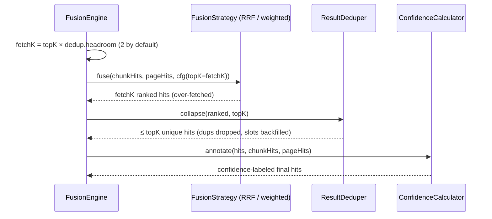
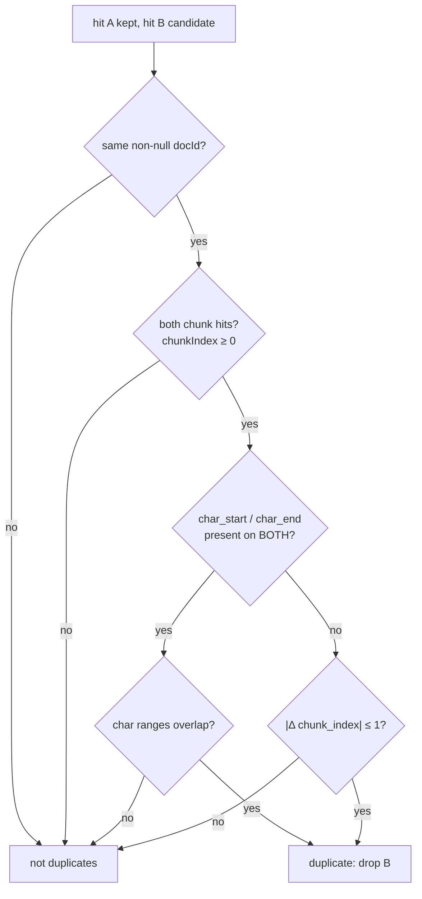

# ResultDeduper

`core/src/main/java/org/hayden/backend/qdrant/fusion/ResultDeduper.java`
(~100 lines). Post-fusion result hygiene: collapses overlapping chunks of the
same document in a ranked hit list, so adjacent sliding-window chunks — which
share `ingest.chunk.overlap-chars` of identical text — don't burn two of the
agent's top-K slots on near-duplicate content.

Strategy-agnostic: it runs *after* `RrfFusion` / `WeightedScoreFusion` (and
after the plain text-only search), so both strategies and all retrieval modes
get the same behavior from one implementation.

## Where it sits



The **over-fetch** is the trick that makes dropping duplicates free: the
strategy returns `topK × ingest.search.dedup.headroom` hits, so every
duplicate removed is backfilled by the next-ranked candidate instead of
shrinking the result list. The over-fetch costs nothing at the Qdrant layer —
pre-fusion pool sizes (`nText = 4×topK`, `nPages = 2×topK`) are unchanged;
only the length of the strategy's *output* grows.

`textOnly` mode gets the same treatment (`searchChunks(withTopK(req, fetchK))`
then `collapse`). `colpaliOnly` is untouched — one point per page, nothing
can overlap.

## What counts as a duplicate



Walking the ranked list in order, a candidate is dropped if it duplicates any
already-accepted hit; the earlier-ranked (better) hit always wins. Three
rules, in precedence order:

1. **Visual orphans never collapse** (`chunkIndex == -1`). A ColPali page hit
   and a text chunk hit on the same page are *complementary* evidence — RRF
   already joined them; deleting one would throw away signal.
2. **Char offsets are authoritative when present.** `char_start`/`char_end`
   from the payload describe the chunk's actual extent in the source stream:
   - sliding-window neighbors **overlap** by `overlap-chars` → ranges overlap
     → duplicates, collapse. Chunk N and N+2 don't overlap → both kept.
   - structural chunks ([StructuralChunker](structural-chunker.md)) are
     emitted with **disjoint** ranges → never collapse, even though their
     indexes are adjacent — they share no text.
3. **Index adjacency is only a fallback** (`|Δ chunk_index| ≤ 1`), for old
   payloads ingested before offsets existed.

Getting the precedence backwards (adjacency first) was a real bug-in-waiting:
it would have silently merged adjacent structural chunks that have nothing in
common but their section.

## Interface & config

```java
@ConfigProperty(name = "ingest.search.dedup.enabled", defaultValue = "true")
boolean enabled;

public boolean enabled();
public List<SearchHit> collapse(List<SearchHit> ranked, int topK);
```

| Key | Env | Default | Meaning |
|---|---|---|---|
| `ingest.search.dedup.enabled` | `INGEST_SEARCH_DEDUP` | `true` | off → `collapse` just truncates to topK, byte-for-byte legacy results |
| `ingest.search.dedup.headroom` | — | `2` | over-fetch factor lives on `FusionEngine`, applied only while dedup is enabled |

## Failure modes

None of its own — pure list processing. Missing/malformed `char_start`/
`char_end` metadata coerces to `-1` (same `asInt`-style tolerance as the
pipelines) and simply demotes the pair to the adjacency rule. Disabled, it
degrades to truncation, never throws.

## Why it's like this

- **Post-fusion, in the engine — not inside each strategy.** One
  implementation serves RRF, weighted, *and* text-only mode; strategies stay
  pure rank/score math.
- **O(accepted × candidates) pairwise scan.** With topK ≈ 5–10 and headroom 2
  the worst case is ~200 comparisons; a hash-by-docId optimization would be
  noise.
- **Confidence annotation stays after dedup.** Response-level confidence is
  `max` over per-hit confidence, which must be computed over the hits the
  agent actually receives.
- **Default-on.** The failure mode of dedup (a legitimately-distinct adjacent
  chunk dropped) costs one slot of marginal redundancy; the failure mode of
  no-dedup (top-5 results that are 3 copies of the same passage) wastes the
  agent's context budget on every query. Flip `INGEST_SEARCH_DEDUP=false` to
  A/B it.

## Tests

`ResultDeduperTest` (8 tests, pure unit):

- `adjacentChunks_collapseKeepingBetterRank` — no offsets → adjacency rule;
  better rank survives.
- `charRangeOverlap_collapsesEvenWhenIndexesNotAdjacent` — index distance 2
  but overlapping ranges → collapse (offsets authoritative).
- `adjacentIndexes_withNonOverlappingRanges_doNotCollapse` — the structural-
  chunk case: adjacent indexes, disjoint ranges → both kept.
- `differentDocs_neverCollapse`, `visualOrphanHits_neverCollapse`.
- `backfill_fillsFreedSlotsFromDeeperCandidates` — 6 candidates / 2 dups /
  topK=4 → exactly the 4 distinct docs, in rank order.
- `disabled_truncatesWithoutCollapsing`.
- `missingCharOffsets_fallBackToAdjacencyRuleOnly` — distance 2, no offsets
  → kept.

End-to-end: `QdrantBackendTest.search_collapsesAdjacentChunksOfSameDoc`
drives the full search path (embed → Qdrant stub → fusion engine) with
adjacent chunks of one doc ranked 1–2 and asserts the response contains the
better one plus the backfilled next doc.
