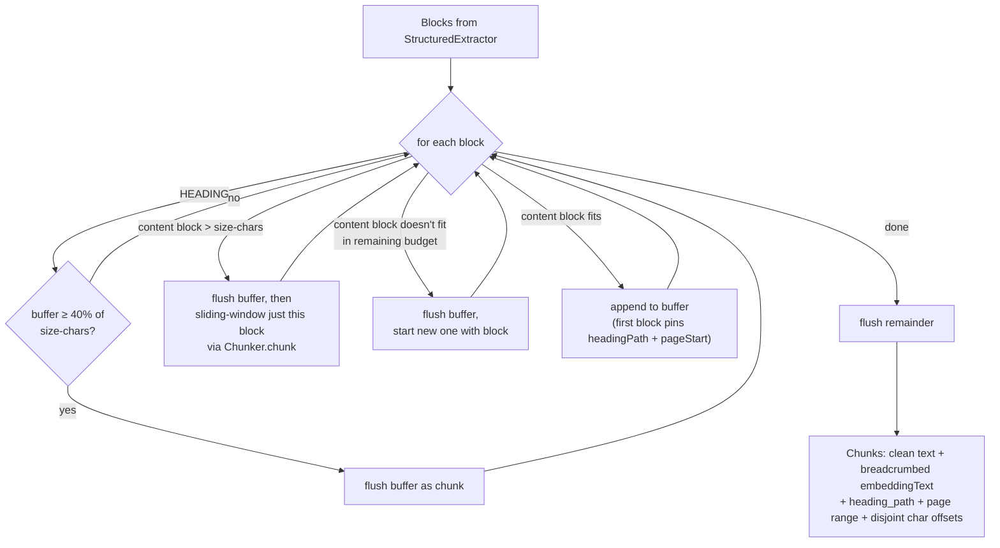

# StructuralChunker

`core/src/main/java/org/hayden/backend/qdrant/StructuralChunker.java`
(~160 lines). The packing half of the structural chunking strategy: takes the
typed `Block` list from [StructuredExtractor](structured-extractor.md) and
produces `Chunk`s along structural boundaries instead of a character window.
Only active when `ingest.chunk.strategy=structural`.

Pure logic, no I/O — same testability profile as [Chunker](chunker.md), which
it composes (the sliding chunker is injected as the fallback for oversize
blocks).

## What it does



Three rules, in priority order:

1. **Headings flush, they don't fill.** A HEADING block never lands in a
   chunk body — its text travels in the breadcrumbs of the blocks under it.
   Hitting a heading flushes the buffer early *if* it's already ≥ 40% full
   (`HEADING_FLUSH_FILL`), so chunks tend not to straddle sections, but a
   heading right after a section start doesn't force out a 30-char runt.
2. **LIST and TABLE blocks are atomic.** They are never split across chunks —
   a table row without its header is retrieval poison. The only exception is
   rule 3.
3. **Oversize blocks fall back to the sliding window.** A single block longer
   than `ingest.chunk.size-chars` (a 3-page paragraph, a giant table) is
   delegated to the injected `Chunker.chunk(text)` — every resulting piece
   still carries the block's page number and heading path.

## The breadcrumb split: `text` vs `embeddingText`

The chunk the agent *sees* and the text the embedder *embeds* are different:

```
Chunk.text()           = "fan curves are configured here…"          ← stored payload, search results
Chunk.embeddingText()  = "Install > Cooling\nfan curves are…"       ← what Embedder.embed receives
payload.heading_path   = ["Install", "Cooling"]                     ← queryable provenance
```

This is the point of the whole strategy: a 700-char chunk about fan curves
embeds *with* its section context, so a query like "cooling configuration"
can match it even when the chunk body never says "cooling" — without
polluting the text returned to the agent.

The prefix is capped at `ingest.chunk.breadcrumb-max-chars` (default 120).
Truncation drops the **outermost** segments first (`… > Cooling > Fan curves`)
— the deepest headings are the most specific signal. `Chunk.embeddingText()`
defaults to `text()` when no override is set, so the sliding pipeline is
untouched by the contract change.

## Contracts preserved (load-bearing, do not break)

| Contract | Who depends on it |
|---|---|
| `chunk_index` is a sequential 0-based counter | `UuidV5.forChunk(docId, i)` point ids; `ResultDeduper` adjacency fallback |
| every chunk carries `pageStart..pageEnd` from its blocks' source pages | fusion's chunk↔page join (`RrfFusion.bestMatchingPage`), `ConfidenceCalculator` text_trust lookup |
| `char_start`/`char_end` are monotonic and **disjoint** (`offset += len + 1`) | [ResultDeduper](result-deduper.md) reads offsets as authoritative overlap evidence — disjoint ranges tell it adjacent structural chunks share no text and must not collapse |

That last row is a deliberate semantic difference from the sliding chunker,
whose adjacent chunks *do* overlap by `overlap-chars` — and whose offsets
therefore overlap too. Same fields, both truthful about their text.

## Interface

```java
@ConfigProperty(name = "ingest.chunk.size-chars",           defaultValue = "1500") int sizeChars;
@ConfigProperty(name = "ingest.chunk.breadcrumb-max-chars", defaultValue = "120")  int breadcrumbMaxChars;
@Inject Chunker slidingFallback;

public List<Chunk> chunkBlocks(List<Block> blocks);
```

Wired in `ChunkPipeline.ingestChunks`:

```java
if ("structural".equalsIgnoreCase(chunkStrategy)) {
    try {
        chunks = structuralChunker.chunkBlocks(structuredExtractor.extractBlocks(file));
    } catch (RuntimeException e) {
        LOG.warnf("… falling back to sliding-window chunking");  // per-file safety valve
    }
}
if (chunks == null) { /* sliding path, byte-for-byte unchanged */ }
```

## Failure modes

| Case | Behavior |
|---|---|
| null/empty block list | `IngestException("Cannot chunk empty block list")` |
| `sizeChars <= 0` | `IngestException` |
| all blocks blank | `IngestException("All blocks were empty; nothing to chunk")` |

All are caught by `ChunkPipeline`'s fallback (above), so a degenerate
extraction degrades to sliding rather than failing the ingest.

## Why it's like this

- **Heading flush threshold (40%), not always-flush.** Always flushing at
  headings produces runt chunks for documents with dense heading structure
  (one short paragraph per heading). The threshold means small sections pack
  together while large sections still split at their boundaries.
- **Breadcrumb in embedded text, not stored text.** Storing the prefix would
  (a) show the agent duplicated boilerplate in every hit and (b) burn stored
  payload bytes; the agent can read `heading_path` if it wants provenance.
  The asymmetry costs one extra field on `Chunk` and nothing else.
- **Truncate breadcrumbs from the outside in.** At 700-char prod chunks
  (bge-small, see deployment notes) a 120-char prefix is ~17% of the
  embedding budget. When over budget, "Cooling > Fan curves" beats
  "Manual > Part II > …" — specificity wins.
- **Composing `Chunker` for oversize blocks instead of reimplementing.** The
  sliding window's boundary preference and forward-progress guard are already
  tested; the structural chunker just re-tags its output with the block's
  page and heading path.

## Tests

`StructuralChunkerTest` (10 tests, pure unit, no WireMock):

- `packsConsecutiveBlocksUpToSize` — two blocks fit, third starts chunk 2.
- `chunkIndexesSequential_andCharRangesDisjoint` — indices 0,1,2…; each
  chunk's `startOffset` > previous `endOffset`.
- `tableBlock_neverSplitsAcrossChunks` — table that doesn't fit beside a
  paragraph gets its own chunk, intact.
- `oversizeBlock_fallsBackToSlidingWindow` — 240-char paragraph at
  `sizeChars=60` → multiple ≤60-char chunks, all tagged page 3 +
  `["Section"]`.
- `breadcrumb_inEmbeddingTextOnly` — `text()` clean, `embeddingText()`
  prefixed, `headingPath` populated.
- `noHeadingContext_embeddingTextEqualsText` — no override when no headings.
- `breadcrumb_truncationDropsOutermostSegments` — 30-char cap → `…`-prefixed
  crumb that keeps the innermost segment.
- `chunkSpanningPages_carriesPageRange` — blocks on pages 3+4 pack into one
  chunk tagged `pageStart=3, pageEnd=4`.
- `headingBoundary_flushesWhenBufferNonTriviallyFull` — >40%-full buffer +
  HEADING → flush; next chunk's embedded text starts with the new section's
  breadcrumb.
- `emptyBlockList_throws`.

End-to-end (strategy switch through the real pipeline):
`QdrantBackendTest.ingest_structuralStrategy_storesHeadingPath_andEmbedsBreadcrumb`
ingests inline HTML with `chunkStrategy=structural` and asserts the Qdrant
upsert payload has `heading_path` + clean `text` while the `/v1/embeddings`
request body carries the breadcrumb prefix.
