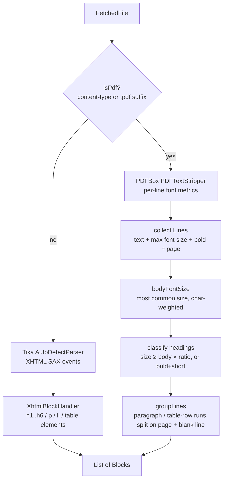

# StructuredExtractor

`core/src/main/java/org/hayden/backend/qdrant/StructuredExtractor.java`
(~330 lines), plus the `Block` record it produces
(`core/src/main/java/org/hayden/backend/qdrant/Block.java`).

The structure-aware alternative to [TextExtractor](text-extractor.md). Where
`TextExtractor` flattens a document into per-page text blobs,
`StructuredExtractor` produces a list of typed **blocks** — headings,
paragraphs, lists, tables — each tagged with its source page and the heading
ancestry it sits under. Only active when `ingest.chunk.strategy=structural`;
the sliding pipeline never touches this class.

## What it does

```java
public List<Block> extractBlocks(FetchedFile file);

public record Block(BlockType type,          // HEADING | PARAGRAPH | LIST | TABLE | OTHER
                    String text,             // lists/tables flattened, one item/row per line
                    int pageNumber,          // 1-based; always 1 for non-PDF
                    List<String> headingPath) // section ancestry, outermost first
```

The `headingPath` is the load-bearing output: it's what lets
[StructuralChunker](structural-chunker.md) prepend a
`"Install > Cooling"` breadcrumb to each chunk's embedded text.

Two different extraction paths converge on the same `Block` shape:



## Path 1: non-PDF (Tika XHTML SAX)

DOCX / HTML / EPUB / etc. carry real structure, and Tika's `AutoDetectParser`
emits it as XHTML SAX events. `XhtmlBlockHandler` (a `DefaultHandler`) maps
elements to blocks directly during the parse — no intermediate XHTML string,
no re-parse:

| XHTML event | Effect |
|---|---|
| `<h1>..<h6>` end | truncate heading stack to `level-1`, push heading text, emit HEADING block |
| `<p>` end | emit accumulated text as PARAGRAPH |
| `<li>` end | append `- item` line to the pending list buffer |
| `<ul>`/`<ol>` end (depth 0) | emit the whole list as one LIST block |
| `<td>`/`<th>` end | collect cell; `<tr>` end joins cells with `\t` |
| `<table>` end (depth 0) | emit the whole table as one TABLE block |
| `<br>` | newline into the current buffer |

`characters()` routes text to the innermost active buffer (table cell > list
item > paragraph), so nested text lands in the right block. Every emitted
block snapshots the **current heading stack** (`List.copyOf`) as its
`headingPath`.

All non-PDF blocks get `pageNumber = 1` — Tika's XHTML stream has no page
concept for these formats, matching `TextExtractor.extractPerPage` semantics.

## Path 2: PDF (PDFBox font heuristics)

Tika emits **no headings for PDFs** (just `<div class="page"><p>…`), so PDF
structure has to be inferred from font metrics. Three passes:

### 1. Collect lines

A `PDFTextStripper` subclass accumulates text per line (flushed on
`writeLineSeparator()` / `endPage()`), recording for each line: the max
`TextPosition.getFontSizeInPt()`, whether any font name contains `bold`, and
`getCurrentPageNo()`. Blank lines are kept — the grouper uses them as
paragraph separators.

### 2. Classify headings

```
bodySize = the font size (rounded to 0.5pt) covering the most characters

isHeading(line) =
      line not empty AND length <= 120
  AND (   fontSize >= bodySize × ingest.chunk.heading-font-ratio   (default 1.15)
       OR (bold AND length <= 60 AND fontSize >= bodySize × 0.95))
```

Heading **levels** come from ranking the distinct heading font sizes
descending: the largest size is level 1, next is level 2, etc. A level-N
heading truncates the heading stack to N-1 entries before pushing itself —
the same stack discipline as the XHTML path, and the stack survives page
breaks (a section that starts on page 3 still prefixes paragraphs on page 5).

### 3. Group lines into blocks

Consecutive non-heading lines accumulate into one block. A new block starts
when any of these change:

- **line type** — a line with ≥3 cells split by tabs / 2+ spaces is a table
  row (`TABLE`); anything else is `PARAGRAPH`
- **page number** — blocks never span pages, keeping `pageNumber` exact
  (fusion joins chunks to ColPali pages by this number)
- **blank line** — paragraph separator

## Failure modes

| Case | Behavior |
|---|---|
| Tika parse error / malformed input | `IngestException("Failed structured extraction from …")` |
| scanned PDF, no text layer | `IngestException(… "ColPali / OCR is required" …)` — same message contract as `TextExtractor` |
| PDF with 0 pages | `IngestException` |
| extracted text exceeds `ingest.extract.max-chars` | `IngestException` (XHTML path counts in `characters()`; PDF path counts after collection) |
| zero blocks after extraction | `IngestException("Structured extraction produced no blocks …")` |

Every one of these is caught by `ChunkPipeline`, which logs a WARN and falls
back to the sliding pipeline **for that file** — a weird PDF can't take down
an ingest.

## Why it's like this

- **SAX handler, not XHTML re-parse.** Tika can emit an XHTML string
  (`ToXMLContentHandler`) that we could re-parse, but feeding a custom
  `ContentHandler` straight into `parse()` avoids materializing and re-parsing
  a 10 MB string for large documents.
- **Font-size ratio, not absolute sizes.** "Headings are ≥ 14pt" breaks the
  moment a document uses 9pt body text. Everything is relative to the
  per-document body size, which is computed by character-weight (a title page
  in 30pt can't outvote 80 pages of 10pt body).
- **Char-weighted mode, not median.** A naive median over *lines* gets
  skewed by short decorative lines; weighting by character count makes the
  body size the size most of the *text* is set in.
- **Tables/rows by whitespace heuristic only (v1).** Real PDF table detection
  needs geometric analysis (column x-positions, ruling lines). The ≥3-cell
  heuristic catches the common case of tab/space-aligned tables; mis-detected
  lines just become slightly odd paragraph blocks — harmless downstream.
- **Bold-short-line fallback.** Many technical manuals set sub-sub-headings
  in bold body-size text. Without the bold rule those sections would silently
  merge into their parent.
- **Heading stack carries across pages.** The alternative (reset per page)
  would strip breadcrumbs from every continuation paragraph, which is most
  paragraphs in a long section.

## Tests

`StructuredExtractorTest` (3 tests, no live services):

- `html_mapsHeadingsParagraphsListsAndTables` — inline HTML fixture with
  h1/h2/p/ul/table → asserts block types in order, heading paths
  (`[Install]`, `[Install, Cooling]`), list flattening (`- first item\n- …`),
  table flattening (`name\tvalue\nrpm\t1200`).
- `html_siblingHeadingReplacesStackAtSameLevel` — `<h2>Cooling</h2> …
  <h2>Power</h2>` → the second h2 replaces the first in the stack, not nests.
- `pdf_classifiesLargeFontLinesAsHeadings_andTracksPages` — synthetic
  two-page PDF built in-test with PDFBox (24pt + 18pt headings over 12pt
  body, same pattern as `PageRasterizerTest`) → asserts both headings
  detected, body paragraphs carry the right `headingPath`, page numbers
  survive, and the stack carries from page 1's heading context into page 2.

Heading-ratio and bold heuristics on *real-world* PDFs are deliberately
validated by the eval protocol ([../eval/retrieval-eval.md](../eval/retrieval-eval.md)),
not unit tests — synthetic fixtures can't represent corpus diversity.
